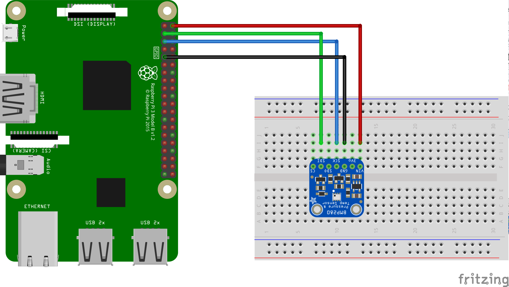

# Barometer for Android things applications

## Project default
https://github.com/androidthings/drivers-samples/blob/master/bmx280/src/main/java/com/example/androidthings/driversamples/BoardDefaults.java

## Hardware
 - Raspberry pi 3
 - BMP280
### Connection


## Functionality
 
Uses BMP280 driver to get the pressure and temperature from a BMP280 sensor 


## Dependencies

Depends on v3 of beta android things library:

```
  provided 'com.google.android.things:androidthings:0.3-devpreview'
  compile 'com.google.android.things.contrib:driver-bmx280:0.1'
```

## Updates from original project

I've found that sometimes the pressure sensor is not present when the app starts, so I added a new listener to know when a new sensor is connected.
